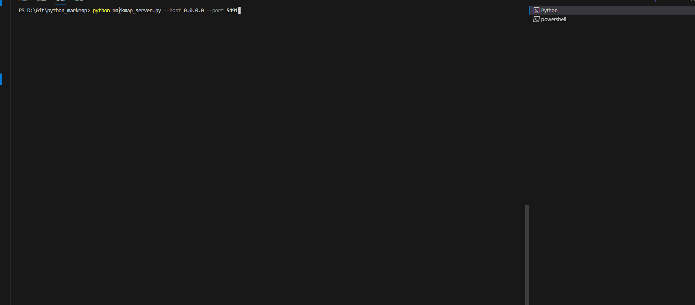
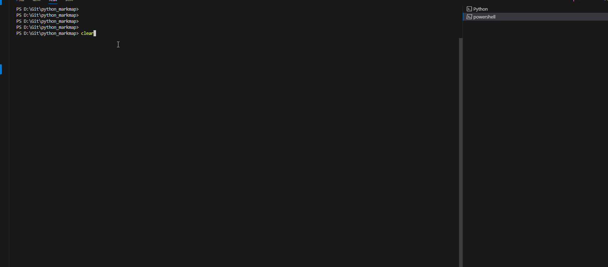

# markmap with python

使用python语言将markdown格式数据生成脑图并通过HTML浏览器方式展示

* 方便不会使用js、React框架的人使用

* 更多信息请参考[markmap](https://github.com/markmap/markmap)、[dundalek's markmap](https://github.com/dundalek/markmap)

# 使用方法

使用方法很简单，主要包括服务端启动和客户端启动两个步骤。

1.下载整个文件，并进入文件路径。在命令行运行以下命令（主机地址和端口自定义）：
```sh
python markmap_server.py --host 0.0.0.0 --port 5491
```


2、进入到markmap_server.py文件中，修改文件中待生成脑图的markdown文本变量markdown、服务启动地址和端口。运行该文件：`python markmap_client.py`：

